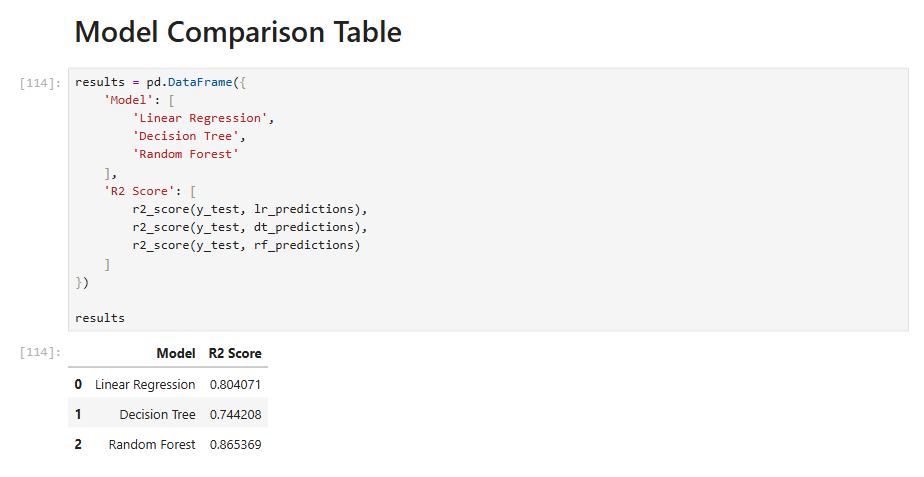
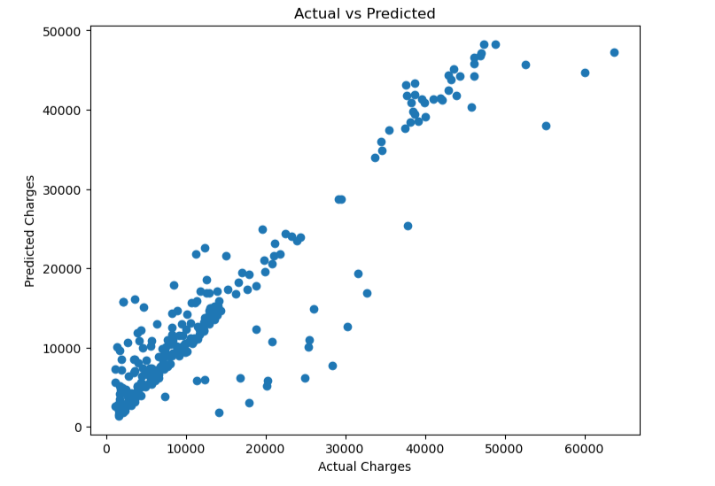
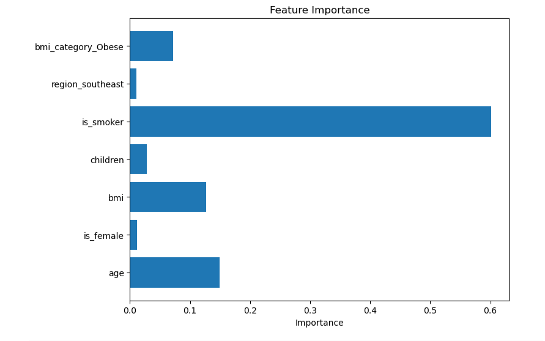

# Insurance Cost Prediction System Using Machine Learning

## Project Overview

This project is an end-to-end machine learning web application that predicts medical insurance costs based on user information such as age, BMI, smoking status, number of children, region, and obesity category.

The project includes:
- Exploratory Data Analysis (EDA)
- Data preprocessing
- Feature engineering
- Statistical feature selection
- Machine learning model comparison
- Flask web application deployment

The final model was deployed using Flask for real-time insurance cost prediction.

---

## Features

- Data cleaning and preprocessing
- Feature engineering
- Chi-square statistical feature selection
- Multiple regression models
- Model evaluation using R² Score and RMSE
- Random Forest-based prediction system
- Responsive Flask web application
- Real-time insurance cost prediction

---

## Machine Learning Algorithms Used

- Linear Regression
- Decision Tree Regressor
- Random Forest Regressor

---

## Best Model Performance

| Model | R² Score |
|---|---|
| Linear Regression | 0.804 |
| Decision Tree | 0.744 |
| Random Forest | 0.865 |

Random Forest Regressor achieved the best performance and was selected as the final deployment model.

---

## Technologies Used

- Python
- Pandas
- NumPy
- Matplotlib
- Seaborn
- Scikit-learn
- Flask
- Bootstrap

---

## Project Structure

```text
Insurance_EDA/
│
├── app.py
├── insurance_model.pkl
├── requirements.txt
├── README.md
├── Procfile
├── runtime.txt
├── insurance.csv
│
├── notebook/
│   └── Insurance_EDA.ipynb
│
├── model_training/
│   └── train_model.py
│
├── templates/
│   └── index.html
│
├── static/
│   └── style.css
│
└── screenshots/
```

---

## Screenshots

### Homepage


---

### Prediction Result


---

### Model Comparison



---

### Actual vs Predicted



---

### Feature Importance



---

## Installation Steps

### Clone Repository

```bash
git clone https://github.com/Harshavardhanrao-03/Insurance_EDA.git
```

---

### Create Virtual Environment

```bash
python -m venv venv
```

---

### Activate Virtual Environment

#### Windows CMD

```bash
venv\\Scripts\\activate
```

---

### Install Dependencies

```bash
pip install -r requirements.txt
```

---

### Run Flask Application

```bash
python app.py
```

---

## Future Improvements

- Streamlit dashboard integration
- Hyperparameter tuning
- Deep learning model integration
- Cloud database integration
- User authentication system

---

## Author

Harshavardhan Rao Velamala